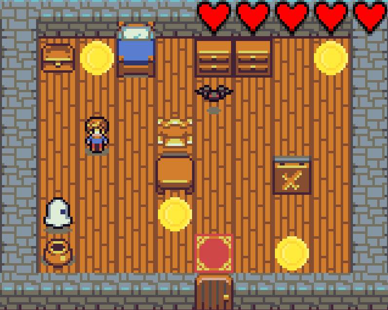

  

<h1 align="center">Ismael Ouanouki</h1>

  Étudiant en BUT Informatique — Développement

  
  

---

## À propos

Je suis étudiant en BUT Informatique à Orsay, spécialisé en développement.  
Je cherche une alternance à partir de septembre 2026 pour continuer à progresser techniquement et m’impliquer dans des projets concrets.

J’accorde beaucoup d’importance à la rigueur, à l’autonomie et au travail propre.

---

## Compétences

**Langages**
- C++
- HTML / CSS / JavaScript
- SQL
- Notions en Assembleur

**Outils**
- Git / GitHub  
- VS Code  
- Teams / Google Workspace  

---

## Projet principal

### Jeu vidéo 2D (C++)

  

Projet réalisé dans le cadre du BUT Informatique.

- Développement du gameplay
- Gestion des interactions
- Travail en binôme (tests, corrections, amélioration)

Ce projet m’a permis de renforcer ma logique algorithmique et ma capacité à travailler en équipe.

---

## Expériences

**Trésorerie Essonne Amendes — 2025**
- Gestion de dossiers et traitement de demandes
- Utilisation d’outils internes
- Organisation et autonomie

**Crash Mobile — Stage 2022**
- Accueil client
- Assistance technique
- Gestion de commandes

---

## Formation

- BUT Informatique — IUT Orsay (2026)
- Bac Général — Mention Bien  
  Maths / Physique-Chimie  

---

## Contact

- ismael.ouaonouki@icloud.com

---

  

